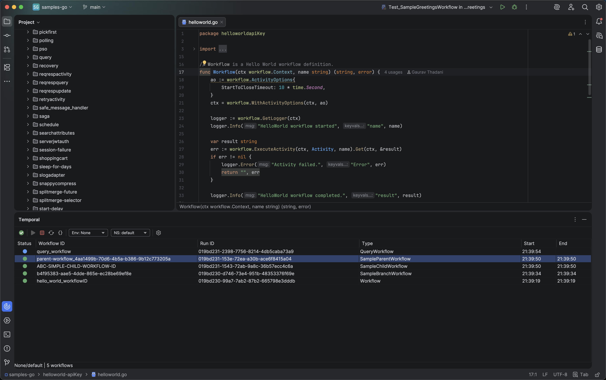

# Temporal.io Plugin for JetBrains IDEs

<!-- Plugin description -->
A JetBrains IDE plugin for browsing and navigating [Temporal](https://temporal.io/) workflows.

**Features:**
- **Workflow Browser** — Browse workflows with status, type, and timestamps directly from your IDE
- **Workflow Details** — View workflow overview, input/output, and complete event history with timestamps and detailed attributes
- **Code Navigation** — Navigate from workflows to their definitions in code (Go, Java)
- **Multi-Environment & Namespace Support** — Work with Temporal Cloud and self-hosted environments, switch between namespaces

**Supported IDEs:**
[IntelliJ IDEA](https://www.jetbrains.com/idea/) |
[GoLand](https://www.jetbrains.com/go/) |
[PyCharm](https://www.jetbrains.com/pycharm/) |
[WebStorm](https://www.jetbrains.com/webstorm/) |
[PhpStorm](https://www.jetbrains.com/phpstorm/) |
[Rider](https://www.jetbrains.com/rider/) |
[RubyMine](https://www.jetbrains.com/ruby/)
<!-- Plugin description end -->

## Screenshots

## Requirements

- **IDE**: JetBrains IDE 2025.2+
- **Temporal CLI**: [Install Temporal CLI](https://docs.temporal.io/cli#install)

## Installation

### From JetBrains Marketplace (Recommended)

1. Open your IDE
2. Go to <kbd>Settings</kbd> → <kbd>Plugins</kbd> → <kbd>Marketplace</kbd>
3. Search for [**"Temporal.io"**](https://plugins.jetbrains.com/search?search=Temporal.io)
4. Click <kbd>Install</kbd> and restart the IDE

### Manual Installation

1. Download the latest release from [GitHub Releases](https://github.com/smolchanovsky/temporal-jetbrains-plugin/releases/latest)
2. Go to <kbd>Settings</kbd> → <kbd>Plugins</kbd> → <kbd>⚙️</kbd> → <kbd>Install plugin from disk...</kbd>
3. Select the downloaded `.zip` file
4. Restart the IDE

<!-- Plugin usage -->
## Getting Started

### 1. Configure Temporal CLI

The plugin uses Temporal CLI for server communication. Ensure it's installed: `temporal --version`

If the CLI is not in your PATH, configure it in <kbd>Settings</kbd> → <kbd>Tools</kbd> → <kbd>Temporal</kbd>

### 2. Connect to Temporal Server

1. Open <kbd>View</kbd> → <kbd>Tool Windows</kbd> → <kbd>Temporal</kbd>
2. Click **Connect**, select environment and namespace

### 3. Browse and Navigate

- Double-click a workflow to view details (overview, input/result, event history)
- Use **Go to Definition** to navigate to workflow code (Go, Java supported)
<!-- Plugin usage end -->

## Contributing

Contributions are welcome! See [CONTRIBUTING.md](CONTRIBUTING.md) for development setup and guidelines.

## License

This project is licensed under the Apache License 2.0 — see the [LICENSE](LICENSE) file for details.

## Acknowledgments

- [Temporal](https://temporal.io/) — Workflow orchestration platform
- [IntelliJ Platform Plugin Template](https://github.com/JetBrains/intellij-platform-plugin-template) — Project foundation
